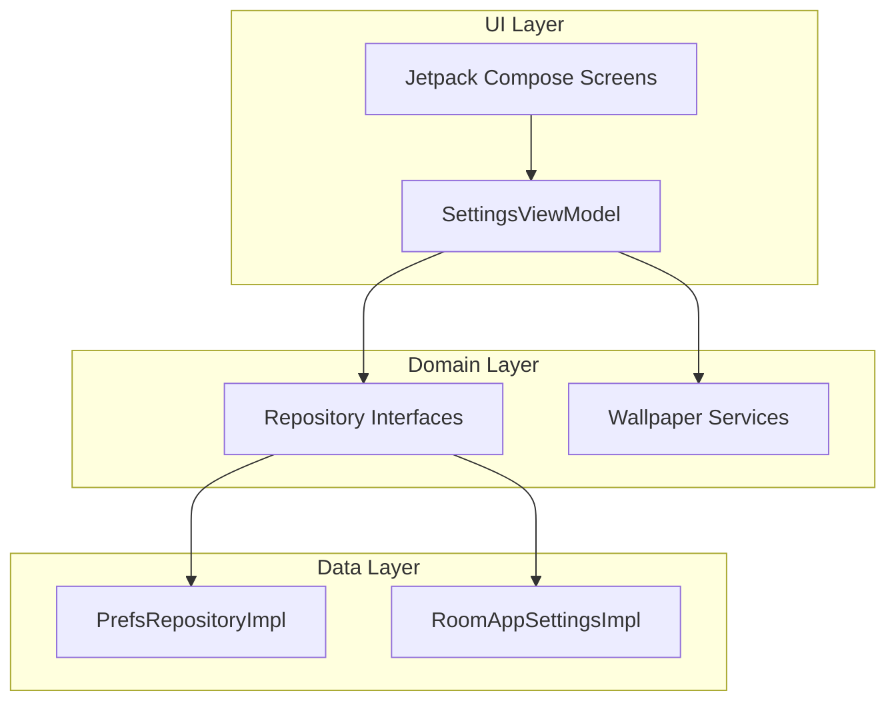

# Sajja Clock Wallpaper

<p align="center">
  
  
  
  
  
  
</p>

Sajja is a high-performance, premium Android live wallpaper application built with modern Android development practices. It renders customizable analog and digital clocks onto a canvas with fluid animations, dynamic HSL-based color schemes, Room-persistent themes, and an interactive full-screen collage designer.

---

## Key Features

*   **Quad Clock Engines**: Dedicated wallpaper services for Roman, Arabic, Digital, and Minimalist ticks.
*   **Dynamic Accent Themes**: Input any color of your choice, and Sajja will automatically generate secondary, tertiary, and contrasting text layers.
*   **Room SQLite Persistence**: Accents and configurations are saved locally via Room DB for instant, stutter-free initialization.
*   **Immersive Collage Designer**: A borderless, fullscreen layout editor with a draggable, glassmorphic floating toolbar. Drag, rotate, and pinch-zoom photos seamlessly.
*   **Gallery Backgrounds**: Select single custom background images directly from your device library.
*   **Navigation transitions**: Fluid slide transitions between config panels using Jetpack Navigation Compose.

---

## Architecture

Sajja implements a strict Clean Architecture model, decoupling code into three main layers:



### Component Structure

*   **Domain Models**: Clean business structures (WallpaperSettings, AppSettings, ClockType).
*   **Data Repositories**: Persistent data layer bridging Room Database entities and Android Shared Preferences.
*   **Canvas Renderer**: A highly optimized rendering system handling custom ticks, hands, borders, and image bounds.

---

## Technical Stack

*   **Core Language**: Kotlin 1.9+
*   **UI Toolkit**: Jetpack Compose (Material Design 3)
*   **Local Database**: Room SQLite (KSP compiler)
*   **Image Loading**: Coil Compose (caches and recycles bitmaps dynamically)
*   **Dependency Injection**: Manual Application Container (SajjaApplication)
*   **Serialization**: GSON for JSON imports and exports

---

## Getting Started

### Prerequisites
*   Android Studio Hedgehog (or later)
*   Android SDK 24+ (Android 7.0 Nougat or higher)
*   JDK 17

### Installation & Build
Clone the repository and compile using the Gradle wrapper:

```bash
# Sync and build the debug APK
./gradlew assembleDebug

# Install on an active emulator or device
./gradlew installDebug
```

---

## Usage Guide

1.  **Select Clock Face**: Expand the FAB menu above the bottom nav bar, and select any clock face (e.g. Roman, Minimal).
2.  **Pick Accent Tone**: Go to App Preferences -> Choose Custom Color to pick your primary tone. Contrast-aware text switches color between black/white automatically.
3.  **Arrange Photos**: Open the Collage Designer, click Open Full Screen Designer, and drag or resize your photos. Move the glassmorphic editing bar anywhere on screen to prevent obstruction.
4.  **Activate Wallpaper**: Click Set Live Wallpaper in the top right of the dashboard, and select Sajja from the system preview.

---

## License

Distributed under the MIT License. See LICENSE for more information.

---

<p align="center">Made with care for Android Customization</p>